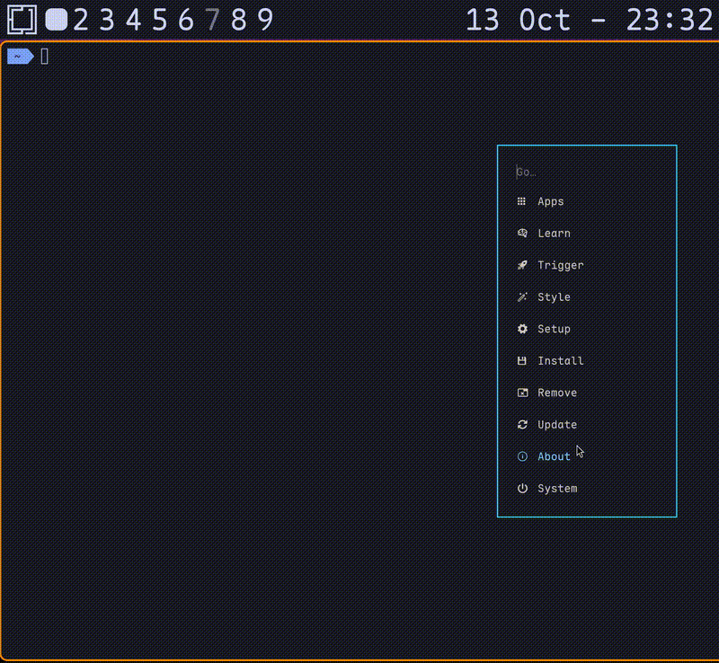

# hyprmarker

A ZoomIt-like screen annotation tool for Wayland compositors, written in Rust. Draw freehand, create shapes, add text, and annotate your screen during presentations or screen recordings.

## Demo




## Quick Install (Arch Linux)

**Install from AUR:**
```bash
# Using yay
yay -S hyprmarker

# Using paru
paru -S hyprmarker
```

**Setup daemon mode:**
```bash
# Enable systemd service (starts on login)
systemctl --user enable --now hyprmarker.service

# Add keybind to ~/.config/hypr/hyprland.conf
bind = SUPER, D, exec, pkill -SIGUSR1 hyprmarker
```

**Done!** Press `Super+D` to toggle overlay, draw with your mouse, press `Escape` to exit.

---

## Features

hyprmarker replicates all the drawing features of Microsoft's ZoomIt for Linux with native Wayland support:

- **Freehand Drawing**: Draw freely with your cursor (default mode)
- **Straight Lines**: Hold `Shift` while dragging
- **Rectangles**: Hold `Ctrl` while dragging
- **Ellipses/Circles**: Hold `Tab` while dragging
- **Arrows**: Hold `Ctrl+Shift` while dragging
- **Text Annotations**: Press `T` to enter text mode, with multi-line support (`Shift+Enter`) and custom fonts
- **Board Modes**: Toggle whiteboard/blackboard (`Ctrl+W`/`Ctrl+B`) with isolated frames and auto-color adjustment
- **Color Selection**: Press color keys (R, G, B, Y, O, P, W, K)
- **Adjustable Line Thickness**: Use `+`/`-` keys or scroll wheel
- **Undo**: `Ctrl+Z` to undo last shape
- **Clear All**: Press `E` to clear all annotations
- **Help Overlay**: Press `F10` to show/hide keybinding help
- **Status Bar**: Shows current tool, color, thickness, and board mode
- **Customizable**: TOML-based configuration file
- **Exit**: Press `Escape` to exit drawing mode

## Installation (Other Distros)

### Prerequisites

**System Dependencies:**
```bash
# Ubuntu/Debian
sudo apt-get install libcairo2-dev libwayland-dev libpango1.0-dev

# Fedora
sudo dnf install cairo-devel wayland-devel pango-devel
```

**Requirements:**
- Wayland compositor with wlr-layer-shell protocol support (Hyprland, Sway, etc.)
- Rust 1.70+ for building from source

### Build from Source

```bash
git clone https://github.com/devmobasa/hyprmarker.git
cd hyprmarker
cargo build --release
```

The binary will be at `target/release/hyprmarker`

### Install Script (Manual Build)

```bash
# Build and install locally
cargo build --release
./tools/install.sh
```

The installer will:
- Install binary to `~/.local/bin/hyprmarker`
- Create config directory at `~/.config/hyprmarker/`
- Optionally add Hyprland configuration

## Usage

### Daemon Mode (Recommended)

Run hyprmarker as a background daemon and toggle it with `Super+D`:

**Option 1: Systemd User Service (Recommended)**

Automatically starts on login and appears in system tray:

```bash
# Run installer and choose option 1
./tools/install.sh

# Or setup manually:
mkdir -p ~/.config/systemd/user
cp packaging/hyprmarker.service ~/.config/systemd/user/
systemctl --user enable --now hyprmarker.service
```

Then add keybind to Hyprland config:
```conf
bind = SUPER, D, exec, pkill -SIGUSR1 hyprmarker
```

**Option 2: Hyprland exec-once**

Run installer and choose option 2, or add manually to `~/.config/hypr/hyprland.conf`:
```conf
# Autostart hyprmarker daemon
exec-once = hyprmarker --daemon

# Toggle overlay with Super+D
bind = SUPER, D, exec, pkill -SIGUSR1 hyprmarker
```

Then reload: `hyprctl reload`

**Usage:**
- Daemon starts automatically on login
- System tray icon appears (may be in Waybar drawer/expander)
- Press `Super+D` to show overlay and start drawing
- Press `Ctrl+Q` or `Escape` to hide overlay (daemon keeps running)
- Right-click tray icon for menu (Toggle/Quit)

### One-Shot Mode

For quick one-time annotations:

```bash
hyprmarker --active

# Or start in whiteboard mode
hyprmarker --active --mode whiteboard

# Or start in blackboard mode
hyprmarker --active --mode blackboard
```

Or bind to a key:
```conf
bind = $mainMod, D, exec, hyprmarker --active
bind = $mainMod SHIFT, D, exec, hyprmarker --active --mode whiteboard
```

### Controls Reference

| Action | Key/Mouse |
|--------|-----------|
| **Drawing Tools** |
| Freehand pen | Default (just drag with left mouse) |
| Straight line | Hold `Shift` + drag |
| Rectangle | Hold `Ctrl` + drag |
| Ellipse/Circle | Hold `Tab` + drag |
| Arrow | Hold `Ctrl+Shift` + drag |
| Text mode | Press `T`, click to position, type, `Shift+Enter` for new line, `Enter` to finish |
| **Board Modes** |
| Toggle Whiteboard | `Ctrl+W` (press again to exit) |
| Toggle Blackboard | `Ctrl+B` (press again to exit) |
| Return to Transparent | `Ctrl+Shift+T` |
| **Colors** |
| Red | `R` |
| Green | `G` |
| Blue | `B` |
| Yellow | `Y` |
| Orange | `O` |
| Pink | `P` |
| White | `W` |
| Black | `K` |
| **Line Thickness** |
| Increase | `+` or `=` or scroll down |
| Decrease | `-` or `_` or scroll up |
| **Font Size** |
| Increase | `Ctrl+Shift++` or `Shift+Scroll Down` |
| Decrease | `Ctrl+Shift+-` or `Shift+Scroll Up` |
| **Editing** |
| Undo last shape | `Ctrl+Z` |
| Clear all | `E` |
| Cancel action | Right-click or `Escape` |
| **Help** |
| Toggle help overlay | `F10` |
| Exit overlay | `Escape` or `Ctrl+Q` |

## Configuration

hyprmarker supports customization through a TOML configuration file.

### Configuration Location

`~/.config/hyprmarker/config.toml`

### Creating Configuration

1. Copy the example config:
   ```bash
   mkdir -p ~/.config/hyprmarker
   cp config.example.toml ~/.config/hyprmarker/config.toml
   ```

2. Edit to your preferences:
   ```bash
   nano ~/.config/hyprmarker/config.toml
   ```

### Configuration Options

```toml
[drawing]
# Default pen color: "red", "green", "blue", etc. or RGB [255, 0, 0]
default_color = "red"
default_thickness = 3.0  # Pixels (1.0-20.0)
default_font_size = 32.0  # Pixels (8.0-72.0)

# Custom font configuration (Pango-based)
font_family = "Sans"  # Any installed font: "Monospace", "JetBrains Mono", etc.
font_weight = "bold"  # "normal", "bold", "light", or numeric (100-900)
font_style = "normal"  # "normal", "italic", "oblique"
text_background_enabled = false  # Semi-transparent background behind text

[arrow]
length = 20.0  # Arrowhead length in pixels
angle_degrees = 30.0  # Arrowhead angle (15-60)

[performance]
buffer_count = 3  # 2=double, 3=triple (recommended), 4=quad buffering
enable_vsync = true  # Prevent tearing

[ui]
show_status_bar = true
status_bar_position = "bottom-left"  # top-left, top-right, bottom-left, bottom-right

[board]
# Board mode configuration (whiteboard/blackboard)
default_mode = "transparent"  # "transparent", "whiteboard", or "blackboard"
whiteboard_color = [0.992, 0.992, 0.992]  # Off-white background (RGB 0.0-1.0)
blackboard_color = [0.067, 0.067, 0.067]  # Near-black background
auto_adjust_pen = true  # Auto-switch pen color for contrast
```

See **[docs/CONFIG.md](docs/CONFIG.md)** for detailed configuration documentation.

## Architecture

hyprmarker is built with a native Wayland backend using modern Rust libraries:

```
hyprmarker/
├── src/
│   ├── main.rs           # Entry point, CLI parsing
│   ├── daemon.rs         # Daemon mode with signal handling
│   ├── ui.rs             # Status bar and help overlay rendering
│   ├── util.rs           # Utility functions
│   ├── backend/
│   │   ├── mod.rs        # Backend module
│   │   └── wayland.rs    # Wayland wlr-layer-shell implementation
│   ├── config/
│   │   ├── mod.rs        # Configuration loader and validator
│   │   ├── types.rs      # Config structure definitions
│   │   └── enums.rs      # Color specs and enums
│   ├── draw/
│   │   ├── mod.rs        # Drawing module
│   │   ├── color.rs      # Color definitions and constants
│   │   ├── font.rs       # Font descriptor for Pango
│   │   ├── frame.rs      # Frame container for shapes
│   │   ├── shape.rs      # Shape definitions (lines, text, etc.)
│   │   └── render.rs     # Cairo/Pango rendering functions
│   └── input/
│       ├── mod.rs        # Input handling module
│       ├── state.rs      # Drawing state machine
│       ├── events.rs     # Keyboard/mouse event types
│       ├── modifiers.rs  # Modifier key tracking
│       └── tool.rs       # Drawing tool enum
├── tools/                # Helper scripts (install, run, reload)
├── packaging/            # Distribution files (service, PKGBUILD)
├── docs/                 # Documentation
└── config.example.toml   # Example configuration
```

### Wayland Backend

The Wayland backend uses:
- **wlr-layer-shell**: Overlay surface creation
- **wl_shm**: Shared memory buffers with triple buffering
- **Cairo**: Vector graphics rendering
- **smithay-client-toolkit**: Wayland protocol handling

**Features:**
- ✅ Full-screen transparent overlay
- ✅ Native HiDPI/scaling support
- ✅ Triple-buffered rendering for smooth drawing
- ✅ Frame-synchronized updates (VSync)
- ✅ Exclusive input capture
- ✅ All drawing tools with live preview

## Platform Support

| Platform | Status | Notes |
|----------|--------|-------|
| Wayland (Hyprland, Sway, etc.) | ✅ **SUPPORTED** | Requires wlr-layer-shell protocol |


## Performance

hyprmarker is optimized for high-resolution displays with smooth 60 FPS drawing:

- **Triple buffering**: Prevents flickering during fast drawing
- **VSync synchronization**: Smooth frame pacing
- **Dirty region optimization**: Minimal data transfer
- **Efficient rendering**: Cairo vector graphics with buffer pooling

Performance characteristics:
- **4K displays**: Smooth 60 FPS
- **1080p/1440p**: Smooth 60 FPS
- **CPU usage**: Low, event-driven architecture

Configure buffer count and VSync in `config.toml` for your setup.

## Documentation

- **[docs/SETUP.md](docs/SETUP.md)** - Detailed installation and system setup
- **[docs/CONFIG.md](docs/CONFIG.md)** - Configuration reference

## Comparison with ZoomIt

| Feature | ZoomIt (Windows) | hyprmarker (Linux) |
|---------|-----------------|-------------------|
| Freehand drawing | ✅ | ✅ |
| Straight lines | ✅ | ✅ |
| Rectangles | ✅ | ✅ |
| Ellipses | ✅ | ✅ |
| Arrows | ✅ | ✅ |
| Text annotations | ✅ | ✅ |
| **Whiteboard mode** | ✅ (W key) | ✅ (Ctrl+W) |
| **Blackboard mode** | ✅ (K key) | ✅ (Ctrl+B) |
| Multi-line text | ❌ | ✅ (Shift+Enter) |
| Custom fonts | ❌ | ✅ (Pango) |
| Color selection | ✅ | ✅ (8 colors) |
| Undo | ✅ | ✅ |
| Clear all | ✅ | ✅ |
| Help overlay | ❌ | ✅ |
| Status bar | ❌ | ✅ |
| Configuration file | ❌ | ✅ |
| Scroll wheel thickness | ❌ | ✅ |
| Zoom functionality | ✅ | ❌ (not planned) |
| Break timer | ✅ | ❌ (not planned) |
| Screen recording | ✅ | ❌ (not planned) |

## Troubleshooting

### Overlay not appearing

1. **Check Wayland environment:**
   ```bash
   echo $WAYLAND_DISPLAY  # Should show wayland-0 or similar
   ```

2. **Check compositor support:**
   ```bash
   # Verify wlr-layer-shell protocol is available
   # Works on: Hyprland, Sway, river, etc.
   # Does NOT work on: GNOME Wayland, KDE Wayland (no wlr-layer-shell)
   ```

3. **Check logs:**
   ```bash
   RUST_LOG=info ./target/release/hyprmarker --active
   ```

### Config not loading

```bash
# Verify config file exists
ls -la ~/.config/hyprmarker/config.toml

# Check for TOML syntax errors in logs
RUST_LOG=info ./target/release/hyprmarker --active
```

### Performance issues

Try adjusting performance settings in `config.toml`:
```toml
[performance]
buffer_count = 2  # Reduce if memory-constrained
enable_vsync = true  # Keep enabled to prevent tearing
```

## Development

### Building for Development

```bash
cargo build
cargo run -- --active
```

### Enable Debug Logging

```bash
RUST_LOG=debug cargo run -- --active
```

### Running Tests

```bash
cargo test
cargo clippy  # Linting
cargo fmt  # Code formatting
```

## Contributing

Contributions are welcome! Areas where help is needed:

1. **Additional compositors**: Test on more Wayland compositors
2. **Multi-monitor support**: Per-monitor overlay surfaces
3. **Additional tools**: Filled shapes, highlighter, eraser
4. **Daemon mode**: Background process with hotkey toggle
5. **Save/load**: Export annotations to image files

## License

MIT License - see [LICENSE](LICENSE) file for details

## Acknowledgments

- Inspired by [ZoomIt](https://learn.microsoft.com/en-us/sysinternals/downloads/zoomit) by [Mark Russinovich](https://github.com/markrussinovich)
- Built for [Hyprland](https://hyprland.org/) by [vaxry](https://github.com/vaxerski)
- Similar to [Gromit-MPX](https://github.com/bk138/gromit-mpx)
- Development approach inspired by [DHH](https://dhh.dk/)'s [Omarchy](https://omarchy.org)
- Uses [Cairo](https://www.cairographics.org/) for rendering
- Built with [Rust](https://www.rust-lang.org/) and [smithay-client-toolkit](https://github.com/Smithay/client-toolkit)

## Development

This tool was developed with AI assistance:
- **Initial concept & planning**: ChatGPT
- **Architecture review & design**: GitHub Copilot
- **Implementation**: Claude Code (Anthropic)

Created as a native Wayland implementation of ZoomIt annotation features for Linux desktop environments.

## Roadmap

- [x] Native Wayland wlr-layer-shell implementation
- [x] Configuration file support
- [x] Status bar and help overlay
- [x] Scroll wheel thickness adjustment
- [x] Daemon mode with global hotkey toggle (Super+D)
- [x] System tray integration
- [x] Autostart with systemd user service
- [x] Multi-line text support (Shift+Enter)
- [x] Custom fonts with Pango rendering
- [x] Whiteboard/Blackboard modes with isolated frames
- [x] Board mode configuration (colors, auto-adjust)
- [x] CLI --mode flag for initial board selection
- [ ] Multi-monitor support with per-monitor surfaces
- [ ] Additional shapes (filled shapes, highlighter)
- [ ] Save annotations to image file
- [ ] Eraser tool
- [ ] Color picker

---

**Note**: This tool focuses solely on screen annotation. For screen magnification (zoom), consider using built-in accessibility tools or dedicated magnifiers like `wlr-randr` zoom or compositor-specific zoom features.
